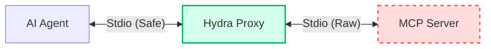

# Hydra: The Self-Healing MCP Supervisor

> **"Cut off one head, two more shall take its place."**

Hydra is a fault-tolerant **Supervisor & Proxy** for Model Context Protocol (MCP) servers. It is built specifically for **AI-Assisted Development**, ensuring that crashes, syntax errors, and "noisy" logs never break the connection between the AI Agent (Claude, Gemini, etc.) and the development server.


---

## 🛑 The Problem

When an AI Agent writes code for an MCP server (e.g., adding a tool to a Python script):
1. The AI saves the file.
2. The server crashes due to a syntax error.
3. **The Connection Dies.** The AI loses its session context, its history, and its ability to fix the error.
4. **The Wallet Bleeds.** You pay tokens to re-explain the context to the AI.

## 🐉 The Hydra Solution

Hydra sits between the AI Client and your MCP Server. It **never dies**, even if the child server does.



### Key Capabilities

*   **🛡️ Session Persistence:** The AI session survives server crashes. Hydra reports the error as a JSON-RPC message, allowing the AI to read the stack trace and fix the code *without* disconnecting.
*   **🔇 Stdio Sanitization:** Hydra filters `stdout`. If your server prints `console.log("Debug")` or panics with a raw stack trace, Hydra captures it, wraps it in a log message, and prevents it from corrupting the JSON-RPC pipe.
*   **⚡ Optimistic Hot-Reload:** Restarts the server instantly (< 500ms) on file save. No "pre-flight" checks; the crash *is* the feedback.
*   **🧠 Context Resurrection:** When the server restarts, Hydra automatically replays:
    *   `initialize` request
    *   `textDocument/didOpen` & `didChange` (File State)
    *   `resources/subscribe` (Log subscriptions)
    *   `logging/setLevel`
*   **💰 Wallet Guard:** Protects against token bombs.
    *   Truncates massive log messages (max 1KB).
    *   Caps tool outputs at 50KB to prevent accidental dumps.
    *   Rate-limits chatty logs (max 10/sec).

---

## 🚀 Getting Started

### Installation
*Currently in Pre-Alpha. Installation instructions coming in Phase 4.*

### Usage

**1. Global Configuration**
Hydra uses a simple JSON config.

```json
// hydra.json
{
  "$schema": "https://hydra.mcp.dev/schema.json",
  "command": "python",
  "args": ["server.py"],
  "env_file": ".env",
  "watch": {
    "paths": ["./src"],
    "ignore_files": [".gitignore"]
  }
}
```

**2. Run**
```bash
hydra run
```

---

## 🛠️ Architecture

Hydra is designed with strict **"AI-Native"** principles:

1.  **Transport Agnostic:** Auto-detects `Content-Length` headers (LSP style) vs NDJSON.
2.  **Cross-Platform:** Uses robust process group management (Tree Kill) to handle zombies on Windows, Linux, and macOS.
3.  **Injectable Tools:** Hydra injects its own tools into the MCP session:
    *   `hydra_restart`: AI can manually trigger a restart.
    *   `hydra_logs`: AI can read the last 50 lines of `stderr`.
    *   `hydra_status`: Check supervisor health.

---

## 🗺️ Roadmap

We are executing a strict, phased implementation plan (see `/phases`):

- [ ] **Phase 1: Foundation** (Transport, Config, Sanitizer)
- [ ] **Phase 2: Core Logic** (Supervisor, StateStore, Watcher)
- [ ] **Phase 3: Orchestration** (Proxy, Tool Injection, Traffic Recorder)
- [ ] **Phase 4: CLI** (Commands, Bootstrap)
- [ ] **Phase 5: Hardening** (Chaos Testing, Benchmarks)

---

## 🤝 Contributing

Hydra follows strict development standards to ensure reliability and token efficiency.
See [PRD.md](./PRD.md) and [docs/](./docs) for details.

**Core Rules:**
*   **No `fmt.Println`**: Use `internal/logger` (stderr only).
*   **Interface-First**: All components must be testable via mocks.
*   **Small Files**: < 200 lines per file.

---

*Built with ❤️ for the MCP Community.*
