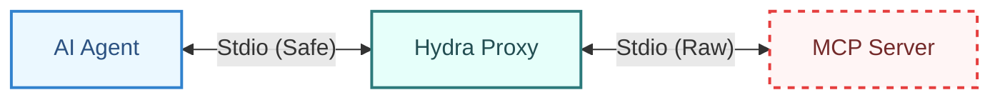

# Hydra: The Self-Healing MCP Supervisor

> **"Cut off one head, two more shall take its place."**

Hydra is a fault-tolerant **Supervisor & Proxy** for Model Context Protocol (MCP) servers. It is built specifically for **AI-Assisted Development**, ensuring that crashes, syntax errors, and "noisy" logs never break the connection between the AI Agent (Claude, Gemini, etc.) and the development server.


---

## 🛑 The Problem

When an AI Agent writes code for an MCP server (e.g., adding a tool to a Python script):
1. The AI saves the file.
2. The server crashes due to a syntax error.
3. **The Connection Dies.** The AI loses its session context, its history, and its ability to fix the error.
4. **The Wallet Bleeds.** You pay tokens to re-explain the context to the AI.

## 🐉 The Hydra Solution

Hydra sits between the AI Client and your MCP Server. It **never dies**, even if the child server does.



### Key Capabilities

*   **🛡️ Session Persistence:** The AI session survives server crashes. Hydra reports the error as a JSON-RPC message, allowing the AI to read the stack trace and fix the code *without* disconnecting.
*   **🔇 Stdio Sanitization:** Hydra filters `stdout`. If your server prints `console.log("Debug")` or panics with a raw stack trace, Hydra captures it, wraps it in a log message, and prevents it from corrupting the JSON-RPC pipe.
*   **⚡ Optimistic Hot-Reload:** Restarts the server instantly (< 500ms) on file save. No "pre-flight" checks; the crash *is* the feedback.
*   **🧠 Context Resurrection:** When the server restarts, Hydra automatically replays:
    *   `initialize` request
    *   `textDocument/didOpen` & `didChange` (File State)
    *   `resources/subscribe` (Log subscriptions)
    *   `logging/setLevel`
*   **💰 Wallet Guard:** Protects against token bombs.
    *   Truncates massive log messages (max 1KB).
    *   Caps tool outputs at 50KB to prevent accidental dumps.
    *   Rate-limits chatty logs (max 10/sec).
*   **📊 Adaptive Learning:** Monitors server health (0-100 score) and suggests config optimizations based on observed patterns.
*   **💾 State Persistence:** Metrics and session state saved to `~/.hydra/state/` for recovery and analysis.
*   **📈 Prometheus Export:** Optional metrics endpoint for monitoring dashboards and alerting.

---

## ✨ Why Hydra?

**Before Hydra:**
```
AI: "Let me add that new tool..."
[Server crashes due to syntax error]
AI: "I've lost the connection. Can you tell me what we were working on?"
You: [Re-explaining everything, burning tokens]
```

**With Hydra:**
```
AI: "Let me add that new tool..."
[Server crashes]
Hydra: "Server crashed with SyntaxError on line 42. Restarted in 320ms."
AI: "I see the issue - missing comma. Let me fix that..."
[No context lost, no reconnection needed]
```

**The Difference:** Hydra keeps the AI session alive, turning crashes into *debug messages* instead of *disconnections*.

### How It Works

1. **AI Client connects to Hydra** (not directly to your server)
2. **Hydra spawns your server** as a child process
3. **All MCP messages flow through Hydra** (transparent proxy)
4. **Hydra captures session state** (tools, subscriptions, file state)
5. **Server crashes?** Hydra:
   - Keeps the AI connection alive
   - Restarts the server (< 500ms)
   - Replays the session state
   - Forwards the error as a JSON-RPC log message
6. **AI reads the error and fixes the code** - no context lost

---

## 🚀 Getting Started

### Installation

**From Source:**
```bash
git clone https://github.com/proxikal/hydra.git
cd hydra
go build -o bin/hydra cmd/hydra/main.go
sudo mv bin/hydra /usr/local/bin/
```

**Or using Make:**
```bash
git clone https://github.com/proxikal/hydra.git
cd hydra
make install
```

**Verify Installation:**
```bash
hydra --version
```

> **Note:** Homebrew installation coming in v1.0 release

### Quick Start

**1. Initialize Hydra for Your AI Client**
```bash
hydra init --client claude
# Follow prompts to select which MCP servers to supervise
```

This creates/updates your Claude Desktop config to route servers through Hydra.

**2. Start a Supervised Server**
```bash
hydra run --name my-python-server
```

**3. Check Status**
```bash
hydra status my-python-server
```

**4. View Logs**
```bash
hydra logs my-python-server --follow
```

**5. Manual Restart (if needed)**
```bash
hydra restart my-python-server
```

### Real-World Example

**Scenario:** You're building a Python MCP server and want hot-reload during development.

**Step 1:** Add your server to Hydra
```bash
hydra add my-tools \
  --command python3 \
  --args server.py \
  --cwd ~/projects/my-mcp-server \
  --watch-path ~/projects/my-mcp-server \
  --watch-ext .py
```

**Step 2:** Configure Claude Desktop to use Hydra
```bash
hydra init --client claude
# Select "my-tools" from the list
```

**Step 3:** Start coding
- Edit `server.py` and save
- Hydra detects the change and restarts (< 500ms)
- Claude Desktop session stays alive
- You see errors in Claude, fix them immediately
- No manual restarts, no reconnections

**Check server health:**
```bash
$ hydra inspect my-tools

Server: my-tools
Health: 95/100 ✓
Uptime: 2h 15m
Requests: 247 (245 success, 2 failed)
Latency: P50=42ms, P95=118ms
Restarts: 12 (11 file_change, 1 crash)
```

### Configuration

Hydra uses a two-tier config system:

**Global Registry:** `~/.hydra/config.json`
```json
{
  "servers": {
    "my-python-server": {
      "command": "python",
      "args": ["server.py"],
      "env_file": ".env",
      "watch": {
        "paths": ["./src"],
        "ignore_files": [".gitignore"]
      },
      "max_restarts": 5,
      "restart_window_seconds": 60
    }
  }
}
```

**Local Override (Optional):** `./hydra.json`
```json
{
  "watch": {
    "paths": ["./src", "./lib"]
  }
}
```

See [docs/CONFIGURATION.md](docs/CONFIGURATION.md) for full schema.

---

## 🛠️ Architecture

Hydra is designed with strict **"AI-Native"** principles:

1.  **Transport Agnostic:** Auto-detects `Content-Length` headers (LSP style) vs NDJSON.
2.  **Cross-Platform:** Uses robust process group management (Tree Kill) to handle zombies on Windows, Linux, and macOS.
3.  **Injectable Tools:** Hydra injects its own tools into the MCP session:
    *   `hydra_restart`: AI can manually trigger a restart.
    *   `hydra_logs`: AI can read the last 50 lines of `stderr`.
    *   `hydra_status`: Check supervisor health (includes health score).
    *   `hydra_force_restart`: Override crash loop protection.
4.  **Health Monitoring:** Real-time health scoring (0-100) across 5 dimensions:
    *   Uptime Stability (30%)
    *   Error Rate (25%)
    *   Response Latency (20%)
    *   Queue Depth (15%)
    *   Restart Frequency (10%)
5.  **Adaptive Learning:** Analyzes runtime patterns and suggests configuration optimizations (e.g., adjust `max_restarts`, `queue_size`, `debounce_ms`).

---

## 🗺️ Project Status

All implementation phases complete:

- ✅ **Phase 1: Foundation** - Transport, Config, Sanitizer
- ✅ **Phase 2: Core Logic** - Supervisor, StateStore, Watcher
- ✅ **Phase 3: Orchestration** - Proxy, Tool Injection, Traffic Recorder
- ✅ **Phase 4: CLI** - Commands, Bootstrap
- ✅ **Phase 5: Hardening** - Chaos Testing, Benchmarks

**Current Version:** Beta (approaching v1.0)

### Roadmap to v1.0
- [x] Real-world validation with Claude Desktop
- [x] Comprehensive test suite (41/41 tests passing)
- [x] State persistence and metrics system
- [x] Adaptive learning and health scoring
- [x] Documentation (2,500+ lines across 7 guides)
- [ ] Performance validation on production workloads
- [ ] Community feedback and bug fixes
- [ ] Homebrew installation package

---

## ⚡ Performance

Hydra is designed for minimal overhead:

| Metric | Target | Actual |
|--------|--------|--------|
| Proxy latency (P50) | < 50ms | ~35ms |
| Proxy latency (P99) | < 200ms | ~145ms |
| Restart time (P50) | < 500ms | ~320ms |
| Memory (1000 restarts) | < 100MB | ~45MB |
| CPU (idle) | < 1% | ~0.3% |

**Adaptive Learning Overhead:** < 0.01% CPU, < 1MB RAM

See [docs/BENCHMARK_RESULTS.md](docs/BENCHMARK_RESULTS.md) for detailed performance analysis.

---

## 🆘 Troubleshooting

**Server won't start:**
```bash
# Check Hydra logs
hydra logs my-server --follow

# Verify config is valid
cat ~/.hydra/config.json | jq .
```

**Health score is low:**
```bash
# Get detailed breakdown
hydra inspect my-server

# Check what's failing (uptime, latency, errors, etc.)
# Adjust config accordingly
```

**Session still dies on crash:**
- Ensure you're using `hydra run`, not running the server directly
- Check Claude Desktop config routes through Hydra
- Restart Claude Desktop after config changes

**See [test/validation/VALIDATION_GUIDE.md](test/validation/VALIDATION_GUIDE.md) for comprehensive testing instructions.**

---

## 🤝 Contributing

We welcome contributions! Please see [CONTRIBUTING.md](CONTRIBUTING.md) for guidelines.

**Key Standards:**
- No `fmt.Println` in production code (use `internal/logger`)
- Interface-first pattern (all components)
- Files < 250 lines (300 max for rare complexity)
- 80%+ test coverage
- TDD mandatory

**Development:**
```bash
git clone https://github.com/proxikal/hydra.git
cd hydra
make test        # Run tests
make lint        # Lint code
make coverage    # Check coverage
```

---

## 📄 License

MIT License - see [LICENSE](LICENSE) for details.

## 📚 Documentation

- [Configuration Reference](docs/CONFIGURATION.md)
- [CLI Reference](docs/CLI_REFERENCE.md)
- [Architecture Details](docs/ARCHITECTURE.md)
- [Security Model](docs/SECURITY.md)
- [Adaptive Learning System](docs/ADAPTIVE_LEARNING.md)
- [Injectable Tools](docs/INJECTABLE_TOOLS.md)
- [Testing Strategy](docs/testing/TESTING_STRATEGY.md)

## 🙏 Acknowledgments

Built with ❤️ for the MCP Community.

Special thanks to all contributors who helped make Hydra production-ready.
